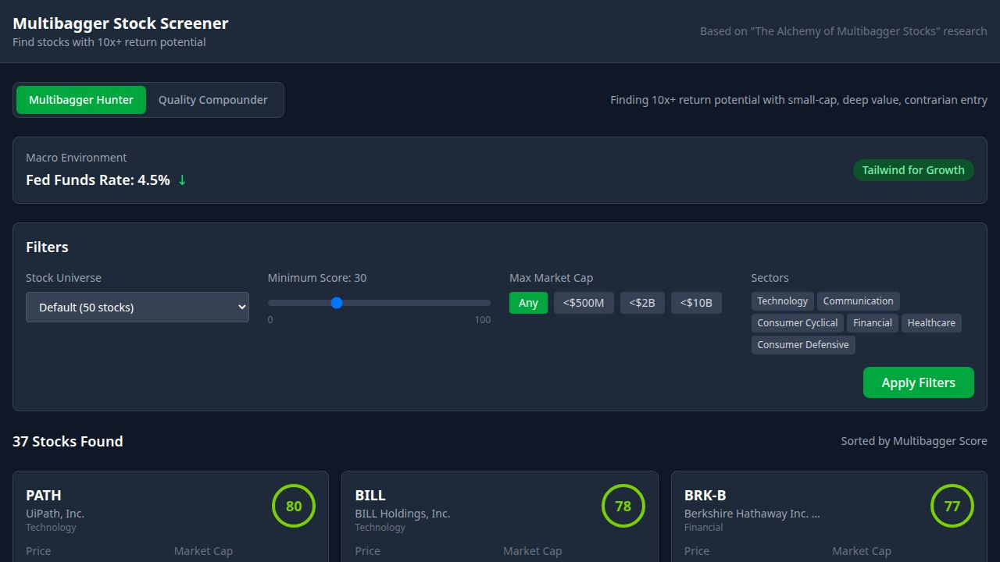

# Multibagger Stock Screener

A quantitative stock screening platform built on the empirical findings from *"The Alchemy of Multibagger Stocks"* (Yartseva, 2025). The research analyzed 464 US stocks that achieved 10x+ returns between 2009–2024 using dynamic panel data modeling, then translated those findings into a scoring engine.



---

## Two screening modes

**Multibagger Hunter** scores stocks on the 7 factors Yartseva identified as statistically predictive of 10x+ returns. It's looking for small, beaten-down, cash-generating companies that are trading below book value — the conditions present before most historical multibaggers ran.

**Quality Compounder** layers on the Compounding Quality framework. It applies stricter pre-filters (ROIC ≥ 15%, FCF conversion ≥ 85%, low leverage) and rewards moat signals, insider ownership, and buyback programs. Designed for stocks that compound at 15%+ annually rather than explosive one-time runs.


---

## The research behind it

Yartseva's study found that the 464 multibaggers shared measurable characteristics *before* their runs — not in hindsight. The key findings operationalized here:

- **Small size is the single biggest predictor.** Median market cap at entry was $348M. Large-caps almost never multi-bag.
- **Contrarian entry matters more than momentum.** Stocks at 40–70% below their 52-week high outperformed. The market had to have given up on them.
- **FCF yield is the most important fundamental factor** (20% weight). Companies generating cash relative to their price had dramatically better outcomes.
- **Book-to-Market > 0.40** was a threshold below which positive excess returns essentially disappeared.
- **Profitability + undervaluation together** outperformed either alone. It's not enough to be cheap — there needs to be a business underneath.
- **Investment pattern** — companies growing assets through EBITDA rather than debt — showed predictive power. Debt-funded growth destroyed returns.

---

## Scoring

### Core factors (Yartseva weights)

| Factor | Weight | Research finding |
|--------|--------|-----------------|
| FCF Yield | 20% | Strongest predictor of multibagger returns |
| Book-to-Market | 15% | B/M > 0.40 required for positive excess returns |
| Entry Point | 14% | 40–70% below 52-week high was optimal |
| Size | 12% | Median multibagger entry market cap: $348M |
| Profitability | 12% | EBITDA margin + ROA composite |
| Investment Pattern | 12% | Asset growth funded by earnings, not debt |
| Macro Environment | 10% | Rate cycle and VIX environment |

### Quality bonuses (Compounding Quality framework)

These add or subtract from the base score and are displayed as badges on each card.

| Signal | Points | Threshold |
|--------|--------|-----------|
| FCF Conversion | +8 / −8 | FCF / Net Income ≥ 90% adds, < 70% subtracts |
| FCF Margin | +5 | FCF margin > 15% |
| Insider Ownership | +8 | > 10% ownership; +5 more for founder-led |
| Buyback Program | +6 / −6 | Share count shrinking adds, growing > 5% subtracts |
| Moat Proxy | +6 | ROIC > 15% and gross margin > 40% |

### Penalty flags

Certain conditions apply hard deductions regardless of factor scores:

- **Negative equity** — liabilities exceed assets: −30 pts
- **Loss-maker with declining assets**: −20 pts  
- **Heavy dilution** — shares up > 10% YoY: −10 pts
- **Unsustainable growth** — assets growing far faster than EBITDA: −8 pts

An "Optimal Multibagger Profile" bonus (+10) applies when a stock hits all four key criteria simultaneously: small size, undervalued, strong FCF, and beaten-down price.

---

## Three-stage screening funnel

```
Stage 1 — Pre-filters
  Multibagger mode: $50M–$50B market cap, positive equity, Net Debt/EBITDA ≤ 4
  Compounder mode:  ROIC ≥ 15%, FCF conversion ≥ 85%, Net Debt/EBITDA ≤ 1

Stage 2 — Core factor scoring
  7 weighted factors → base score (0–100)

Stage 3 — Quality bonuses + penalty flags
  5 bonus factors and hard deductions → final composite score
```

---

## Setup

```bash
# Backend
pip install -r requirements.txt
uvicorn backend.main:app --host 0.0.0.0 --port 8000 --reload

# Frontend
cd frontend
npm install
npm run dev
```

**Optional:** Add a `FMP_API_KEY` environment variable to unlock expanded universe screening via [Financial Modeling Prep](https://financialmodelingprep.com). Without it, the screener falls back to a built-in universe of ~50 stocks.

---

## API

```
GET /api/screen?mode=multibagger&universe=small_cap&min_score=50&limit=50
GET /api/stock/{ticker}?mode=compounder
GET /api/macro
GET /api/universe?source=small_cap&limit=100
```

`mode` — `multibagger` or `compounder`  
`universe` — `default` (50 stocks), `small_cap`, `mid_cap`, or `expanded` (150+, requires FMP key)

---

## Stack

- **Backend** — Python, FastAPI, yfinance
- **Frontend** — React, Vite, Tailwind CSS
- **Data** — Yahoo Finance (live), Financial Modeling Prep (universe expansion)

---

## Changelog

**v2** — Dual-mode screening, 5 quality bonus factors, FMP universe integration, collapsible filter panel  
**v1** — Single-mode Yartseva scoring, 7 core factors, yfinance data
